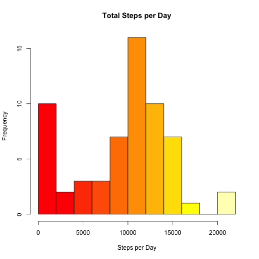
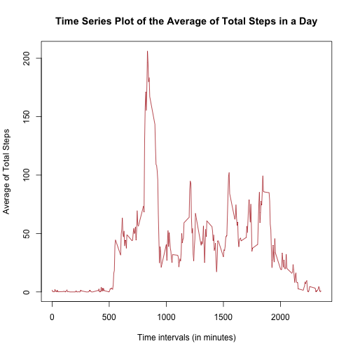
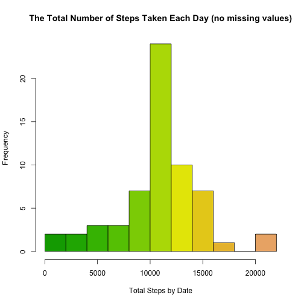
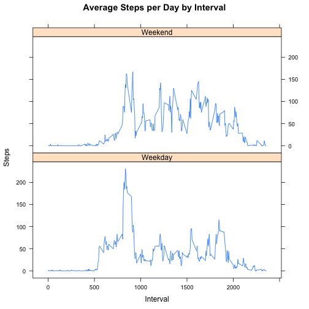

###**First: Loading and preprocessing the data**

**Download, unzip and load data into data frame**

```r
if(!file.exists("getdata-projectfiles-UCI HAR Dataset.zip")) {
  temp <- tempfile()
  download.file("http://d396qusza40orc.cloudfront.net/repdata%2Fdata%2Factivity.zip",temp)
  unzip(temp)
  unlink(temp)
}
```


**Reading the dataset in R**


```r
act <- read.csv("~/Desktop/Personal/Education and Training/Coursera/Reproducible Research/RR/activity.csv")
```

*Having a first look at the data*


```r
str(act)
```

```
## 'data.frame':	17568 obs. of  3 variables:
##  $ steps   : int  NA NA NA NA NA NA NA NA NA NA ...
##  $ date    : Factor w/ 61 levels "2012-10-01","2012-10-02",..: 1 1 1 1 1 1 1 1 1 1 ...
##  $ interval: int  0 5 10 15 20 25 30 35 40 45 ...
```

```r
head(act)
```

```
##   steps       date interval
## 1    NA 2012-10-01        0
## 2    NA 2012-10-01        5
## 3    NA 2012-10-01       10
## 4    NA 2012-10-01       15
## 5    NA 2012-10-01       20
## 6    NA 2012-10-01       25
```


###**Second: What is mean and median for the total number of steps taken per day?**

**Histogram of the total number of steps taken each day. Prior to conducting the histogram, I use the tapply() function to calculate the sum of the activities per day.**


```r
steps_per_day = tapply(act$steps,act$date,sum,na.rm=TRUE)

hist(steps_per_day,col=heat.colors(11),breaks = 10, xlab="Steps per Day",main="Total Steps per Day")
```

 

*The mean and the median for the total number of steps per day:*


```r
mean(steps_per_day)
```

```
## [1] 9354.23
```

```r
median(steps_per_day)
```

```
## [1] 10395
```

**The results show that the mean is 10766 and the median is 10765 steps per day.**


###**Third: What is the average daily activity pattern?**

**To find the average daily activity pattern, first I create a time series plot (i.e. type = “l”) of the 5-minute interval (x-axis) and the average number of steps taken, averaged across all days (y-axis). I use tapply() to calculate the mean of the steps per interval, so that I can conduct the time series plot and find the required average**


```r
interval_mean <- tapply(act$steps,act$interval,mean,na.rm=TRUE)

plot(row.names(interval_mean),interval_mean,type="l", col = "firebrick", 
     xlab="Time intervals (in minutes)",
     ylab="Average of Total Steps",
     main="Time Series Plot of the Average of Total Steps in a Day")
```

 

** To check which 5-minute interval, on average across all the days in the dataset, contains the maximum number of steps**


```r
interval_mean[which.max(interval_mean)]
```

```
##      835 
## 206.1698
```

**It appears that the interval 835 contains maximum number of steps 206.**


###**Fourth: Imputing missing values.**

**Initially, we calculate and report the total number of missing values in the dataset (i.e. the total number of rows with NAs)**


```r
sum(is.na(act$steps))
```

```
## [1] 2304
```

**So the data set has 2304 rows with missing values.**

**We use a simple strategy for filling in all of the missing values in the dataset. If a 5-minute interval has missing value, we use the mean for that 5-minute interval.**
**To do so, I create first two separate data frames, one without NAs and one with all rows with NA values for the steps vector. Then, I input the vector of interval mean into the data frame that contains all NAs for the steps variable. Once this is done, the data frame with no NAs will be bent with the data frame that now contains all of the mean values for the corresponding time intervals. Lastly,a new dataset is created that is equal to the original dataset but with the missing data filled in.**


```r
act_na <- act[is.na(act),]
act_no_na <- act[complete.cases(act),]
act_na$steps <- as.numeric(interval_mean)
new_act <- rbind(act_na,act_no_na)
new_act <- new_act[order(new_act[,2],new_act[,3]),]
```


** Make a histogram of the total number of steps taken each day, but proir to that and using tapply() function, I calculate and report the mean and median total number of steps taken per day.**


```r
new_sum_by_date <- tapply(new_act$steps,new_act$date,sum)

hist(new_sum_by_date,col=terrain.colors(15),breaks = 10, xlab="Total Steps by Date",main="The Total Number of Steps Taken Each Day (no missing values)")
```

 

```r
mean(new_sum_by_date)
```

```
## [1] 10766.19
```

```r
median(new_sum_by_date)
```

```
## [1] 10766.19
```

**Based on the imputed data set, the new mean is 10766 and the new median is 10766.**

**When comparing the two histograms, the one representing the original data containing missing values appears skewed to the left whereas the one representing the data without the missing data closely resembles a normal distribution curve. Hence, excluding the missing values from the data set gives more accurate distribution of the data, thereby providing a better repesentation of the amount of steps that are taken during specific intervals during the day.**


###**Fifth: Are there differences in activity patterns between weekdays and weekends?**

**Intially we create a new factor variable “dow” in the dataset with two levels - “weekday” and “weekend” indicating whether a given date is a weekday or weekend day.**


```r
weekdays <- c("Monday", "Tuesday", "Wednesday", "Thursday", "Friday")

new_act$dow = as.factor(ifelse(is.element(weekdays(as.Date(new_act$date)),weekdays), "Weekday", "Weekend"))

steps_by_interval_i <- aggregate(steps ~ interval + dow, new_act, mean)
```


**Lastly, I created a plot to compare and contrast number of steps between the week and weekend.**


```r
library(lattice)
xyplot(steps_by_interval_i$steps ~ steps_by_interval_i$interval|steps_by_interval_i$dow, main="Average Steps per Day by Interval",xlab="Interval", ylab="Steps",layout=c(1,2), type="l")
```

 

**The plots indicate that there is a higher peak earlier on weekdays, and more overall activity on weekends.**
